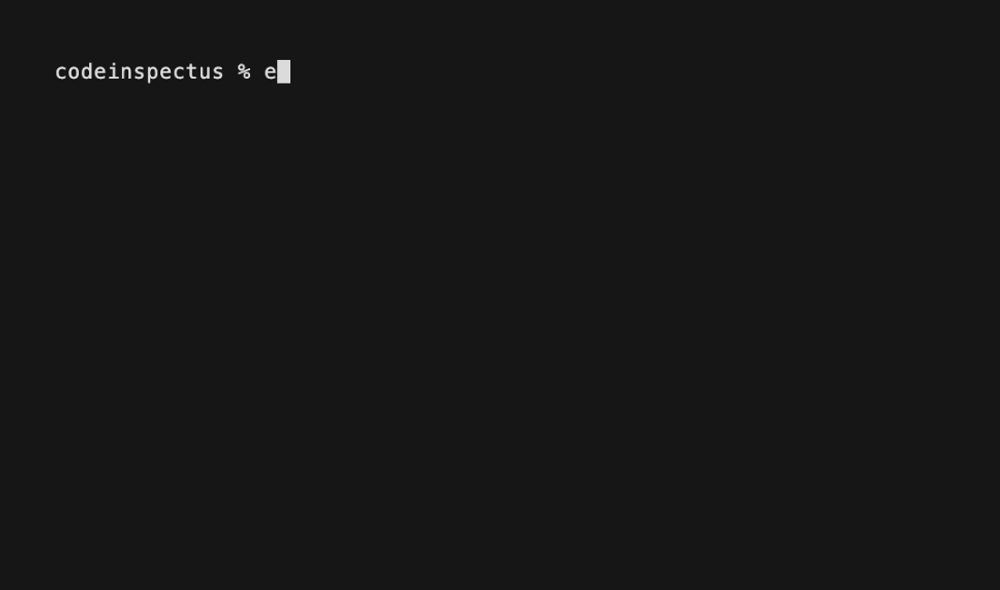

# CodeInspectus, by Synvoya

[](LICENSE)
[](package.json)


[](https://glama.ai/mcp/servers/Synvoya/codeinspectus)

**A local-first, privacy-preserving security MCP server.** Any AI coding agent
(Claude Code, Cursor, Codex, Windsurf, Cline, Aider) can invoke CodeInspectus to
scan AI-generated / "vibe-coded" code for real vulnerabilities, map findings to
compliance frameworks as honest code-level coverage, and drive a **scan → fix →
rescan** loop — fully on your machine, with **no account** and **zero network
egress at scan time**.



CodeInspectus orchestrates three best-in-class OSS engines behind one normalized,
CWE-keyed schema, and adds its own **AI-code-specific checks** that generic
scanners miss:

- **Opengrep** — SAST / OWASP Top 10 (SARIF)
- **Gitleaks** — secrets
- **Trivy** — dependency CVEs (SCA), IaC misconfig, secrets, license, SBOM
- **CodeInspectus AI checks** — client-side secret/bundle exposure, Supabase
  RLS / inverted-auth (the CVE-2025-48757 class), prompt-injection sinks,
  client-writable `user_metadata` authorization, and unsanitized model/user output
  rendered via `dangerouslySetInnerHTML` (XSS / LLM05)

> CodeInspectus bundles the official, **SHA-pinned** engine binaries and calls
> them as local subprocesses. It does **not** fork them.

## Why CodeInspectus?

AI-generated apps often ship with security mistakes that generic scanners miss: exposed
client-side secrets, weak Supabase auth patterns, unsafe HTML rendering, prompt-injection
sinks, and insecure agent/tool integrations.

CodeInspectus combines proven local scanners with AI-app-specific rules, then exposes the
workflow through an MCP server so coding agents can scan, explain, and help fix issues
before shipping.

## Install

**Prerequisites:** **Node.js ≥18**, and [**cosign**](https://github.com/sigstore/cosign)
on your `PATH` for `install-engines`. Signature verification is **fail-closed**: **Opengrep**
and **Trivy** will **not** pin without cosign — `install-engines` exits non-zero for them —
so install it first (`brew install cosign`). **Gitleaks** verifies by checksum and needs no
cosign.

```bash
# Register once per machine with your agent (see "Client registration"), then:
npx codeinspectus install-engines
```

`install-engines` is the **only** step that touches the network. It downloads the
engine binaries from their verified GitHub release URLs, checks the publisher
signature/checksum, computes each binary's SHA256, and records it in
`engines.lock.json`. It also fetches the offline Trivy vulnerability-DB snapshot
into `~/.codeinspectus/`. After this, **scans perform zero network I/O.**

Re-verify your pinned binaries any time:

```bash
npx codeinspectus verify-engines
```

An MCP server is installed **once per machine** and shared across all your
projects — it is **not** a per-repo `npm install` dependency.

## Client registration

Same JSON shape everywhere; only the location differs.

```jsonc
{
  "mcpServers": {
    "codeinspectus": { "command": "npx", "args": ["-y", "codeinspectus"] }
  }
}
```

| Client | How |
|--------|-----|
| **Claude Code** | `claude mcp add-json codeinspectus '{"command":"npx","args":["-y","codeinspectus"]}'` |
| **Cursor** | add to `~/.cursor/mcp.json` (or project `.cursor/mcp.json`) |
| **VS Code** | `code --add-mcp '{"name":"codeinspectus","command":"npx","args":["-y","codeinspectus"]}'` |
| **Codex / Windsurf / Cline / Aider** | add the same block to that client's MCP config |

Optional: drop in the ready-made [`agent-rules/`](agent-rules/) so your agent
auto-runs the scan → fix → rescan loop.

## Tools

| Tool | Purpose |
|------|---------|
| `codeinspectus_scan` | Full local scan of a path (engines + AI checks). Returns CWE-keyed findings, remediations, framework tags. |
| `codeinspectus_rescan` | Re-scan after fixes; diffs vs a prior scan → resolved / remaining / introduced. |
| `codeinspectus_compliance_report` | Per-framework **code-level control coverage** (not certification). |
| `codeinspectus_explain_finding` | Deep explanation + full remediation for one finding. |
| `codeinspectus_generate_sbom` | CycloneDX/SPDX SBOM (written to the managed dir by default, or a path you choose). |
| `codeinspectus_list_rules` | Active detectors, engine versions, detection-DB + Trivy-DB freshness. |

CodeInspectus **never edits or deletes your source code or repository** — it reads and
reports; your agent applies the fixes. It stores engine data and scan history under
`~/.codeinspectus`; the only file it writes is an optional SBOM — to a managed directory
by default, or a path you choose (see `codeinspectus_generate_sbom`).

Each scan also reports a read-only **git-safety** state: if there's no git repo or
uncommitted changes, it recommends creating a checkpoint before fixes — your agent
runs git only with your approval; the tool never does.

## Honest claims (please read)

- **"No egress" is precise: zero egress _at scan time_.** Engine binaries and the
  initial Trivy DB are fetched _at install time_ from verified sources, with
  SHA256 verification. The scanner functions with the network unplugged. There is
  **no telemetry, ever.**
- **Supply-chain pinning is mandatory.** Trivy was supply-chain-compromised twice
  in early 2026; every engine binary is SHA-pinned in `engines.lock.json` and its
  hash is verified before execution. CodeInspectus refuses to run an unpinned or
  mismatched binary.
- **Secret values are redacted** in all output — type + location + a redacted
  preview only.
- **Compliance = code-level control coverage, never certification.** CodeInspectus
  reports "X of N **code-visible** controls have findings", with the code-visible
  subset as the explicit denominator, plus a standing disclaimer. It never emits
  "you are X% compliant" or "you pass [framework]". The severity-weighted posture
  score is a separate view and is not a percent-compliant figure. **Essential
  Eight** especially: only ~1 of 8 mitigations (Patch Applications) is
  code-evidenced — this is **not** an Essential Eight assessment.
- **Prompt-injection detection is heuristic and immature** — those findings are
  worded "potential …" and marked medium confidence.
- **Client-side authorization that trusts `user_metadata` is flagged** (`ci-ai-client-metadata-authz`).
  CodeInspectus detects an authorization decision that reads client-writable Supabase
  `user_metadata` — e.g. `if (user.user_metadata.role === 'admin')` — at **high** severity,
  **medium** confidence (CWE-639). `user_metadata` is editable by the signed-in user themselves
  (Supabase's `/auth/v1/user` endpoint), so anyone can self-assign `role: 'admin'`; **gate
  privileged logic on the server-controlled `app_metadata.role` instead.** Detection is intrafile
  (inline + split-variable/destructured); it does **not** yet trace cross-file or whole-object-alias
  flows (planned) — see the [good-first-issue](docs/good-first-issues/user-metadata-authz-rule.md).
  It also catches the related footgun: a Supabase **`service_role` key value** in client-reachable
  code (**critical**), and a `service_role` key behind a **client-exposed env prefix** such as
  `NEXT_PUBLIC_…` (**high**).
- **Unsanitized model or user output rendered as raw HTML is flagged** (`ci-ai-llm-output-dangerous-html`).
  CodeInspectus detects untrusted **request input** or **LLM/model output** flowing into
  `dangerouslySetInnerHTML` without sanitization — a direct XSS sink (CWE-79/116; OWASP **LLM05** on
  the model-output path), **high** severity, **medium** confidence; wrapping the value in
  `DOMPurify.sanitize(...)` silences it. It does **not** yet trace untrusted values arriving via
  **component props, database rows, or template data** (planned).

## Language support

Plainly, what runs on what. The commodity engines are broad; the **CodeInspectus
AI-code checks (the moat) are JavaScript/TypeScript-focused today** — more languages
are planned. So on a Python/Go/Rust/etc. repo you still get full secrets, dependency,
IaC and SBOM coverage (and Python SAST), but the AI-code-specific checks won't fire.
This is stated so you don't infer coverage that isn't there.

| Layer | What it covers | Language / ecosystem scope |
|-------|----------------|----------------------------|
| **Secrets** — Gitleaks + CodeInspectus client-secret checks | hard-coded credentials, leaked keys | **Any language.** Detection is value/pattern-based, not language-parsed. |
| **Dependencies (CVEs/SCA), IaC misconfig, SBOM, license** — Trivy | vulnerable deps, infra misconfig, bill of materials | **Many language & package ecosystems and IaC formats** — see [Trivy's docs](https://trivy.dev). |
| **SAST** — Opengrep + CodeInspectus `security-baseline` | injection, XSS, SSRF, weak crypto, insecure deserialization | **JavaScript, TypeScript, Python.** CodeInspectus ships its own MIT ruleset and runs Opengrep with **no network registry packs**, so SAST coverage is exactly these languages — deliberately narrower than Opengrep's full engine. |
| **AI-code checks (the moat)** — client-side secret/bundle exposure, Supabase RLS, prompt-injection sinks, client-writable `user_metadata` authz, unsanitized-output XSS | the AI-code / vibe-coding failure modes the engines miss | **JavaScript / TypeScript only** (incl. `.jsx/.tsx/.mjs/.cjs`; the client-secret checks also read JS-framework files `.vue/.svelte/.astro/.html`). Supabase RLS analyzes `.sql` (plus `.ts/.js` Edge Functions). **More languages are planned.** |

## Compliance frameworks (code-visible subset)

NIST CSF 2.0 · ISO/IEC 27001:2022 · SOC 2 · CIS Controls v8.1 · Essential Eight
(Patch Applications only) · OWASP Top 10 (2021) · OWASP LLM Top 10 (2025).
MITRE ATT&CK techniques are shown as related-adversary context only, never as a
coverage score.

> **Compliance mappings are AI-drafted, reviewed by a cybersecurity practitioner
> (Synvoya) — code-level coverage only, not an audit or certification. Community review
> welcome.** The CWE→control mappings are self-audited with per-mapping confidence and an
> open community-verification process — see
> [`docs/COMPLIANCE-RATIONALE.md`](docs/COMPLIANCE-RATIONALE.md) and
> [`CONTRIBUTING.md`](CONTRIBUTING.md). Essential Eight is **not** a coverage view: only
> Patch Applications is code-evidenced (~1 of 8) — this is not an Essential Eight assessment.

## How it works

```
agent → codeinspectus_scan → [Opengrep | Gitleaks | Trivy] + AI checks
      → SARIF normalize → dedup (incl. Trivy⨯Gitleaks secret overlap)
      → CWE-keyed findings → compliance map → compact JSON + summary
ALL LOCAL. NO NETWORK EGRESS AT SCAN TIME.
```

## Example reports

- [Next.js + Supabase SaaS app](examples/reports/nextjs-supabase.md)
- [AI chatbot / RAG app](examples/reports/ai-chatbot-rag.md)
- [Node/React app](examples/reports/node-react.md)

## Trademark

"CodeInspectus" is the name of this free, open-source project (npm `codeinspectus`,
`codeinspectus.com`). "Code Inspect" is a descriptive phrase in a crowded namespace;
registry availability is not trademark clearance, and the name is **not claimed as a
trademark**.

## Development

```bash
npm install
npm run build      # tsc --noEmit && tsup  (must compile clean)
npm run eval       # ≥10 evals against fixtures/vulnerable-app
npm run inspector  # npx @modelcontextprotocol/inspector node dist/index.js
```

How this repository is generated (an auditable, allow-list seed) and built end-to-end:
[`docs/BUILD.md`](docs/BUILD.md).

## Contributing

CodeInspectus is a **solo, free, open-source** project, built and maintained by
one cybersecurity practitioner under the **Synvoya** name. There is no company
behind it and nothing to sell — which is exactly why outside eyes matter.
**Independent review is genuinely wanted**, not a courtesy line. If you work in
security, your scrutiny is the contribution.

Two areas where review helps most:

- **Compliance CWE→control mappings.** These are **AI-drafted, then policy-reviewed
  by the maintainer** — they are **NOT independently verified.** Every mapping is
  tracked through three explicit states: **AI-drafted → maintainer-policy-reviewed →
  community-verified.** Today almost everything sits in the first two; the
  community-verified count is **0 of 96**, and that is reported honestly rather than hidden.
  Moving a mapping to *community-verified* takes evidence (a quote from the control's
  primary source + your basis) — the bar and process are in
  [`CONTRIBUTING.md`](CONTRIBUTING.md); the per-mapping rationale and confidence live
  in [`docs/COMPLIANCE-RATIONALE.md`](docs/COMPLIANCE-RATIONALE.md).
- **Detection rules** (`detection-db/**`, `src/ai-checks/**`). New rules, precision
  fixes, and false-positive reports are all welcome. The merge bar is **precision**:
  a fixture proving the true positive, and a near-miss fixture proving the rule does
  **not** over-fire. Details in [`CONTRIBUTING.md`](CONTRIBUTING.md).

What CodeInspectus claims — and what it deliberately does **not** — is written down so
you can check it before trusting a number: the standing compliance disclaimer (in the
[Compliance frameworks](#compliance-frameworks-code-visible-subset) section above and in
[`docs/COMPLIANCE-RATIONALE.md`](docs/COMPLIANCE-RATIONALE.md)) and the three-state
honesty metric. If something reads as over-claiming, that is a bug — please open an issue.

Workflow: **fork → branch → PR**; the maintainer reviews and merges (external
contributors don't push directly). — *Synvoya (the maintainer, a cybersecurity
practitioner)*

## Good first contributions

- Add a fixture for the unsafe raw inner-HTML sink (`ci-ai-llm-output-dangerous-html`) from component props.
- Improve detection for Supabase `user_metadata.role` authorization checks.
- Add detection for exposed `NEXT_PUBLIC_OPENAI_API_KEY` and similar client-side AI keys.
- Add a rule for user-controlled URLs passed into server-side `fetch()`.
- Add a rule for model output passed into `eval`, `Function`, shell commands, or unsafe tool calls.
- Add a check for missing auth guards in Next.js `/api/admin/*` routes.
- Verify one CWE to OWASP Top 10 mapping.
- Verify one CWE to SOC 2 / ISO 27001 mapping.
- Add a vulnerable fixture and expected finding snapshot for an existing rule.

## Changelog

Per-version release notes live in [`CHANGELOG.md`](CHANGELOG.md). Current: **v0.3.0**.

## Licenses

CodeInspectus: MIT. Bundled engines: Opengrep (LGPL-2.1), Gitleaks (MIT, CLI
only), Trivy (Apache-2.0) — all permissive for bundling the compiled binaries.
