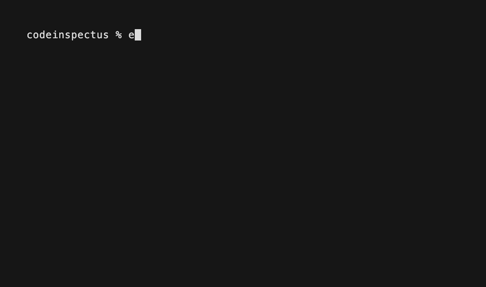

# CodeInspectus, by Synvoya

[](LICENSE)
[](package.json)
[](https://www.npmjs.com/package/codeinspectus)


[](https://registry.modelcontextprotocol.io/v0/servers?search=io.github.Synvoya%2Fcodeinspectus)
[](https://glama.ai/mcp/servers/Synvoya/codeinspectus)
[](https://github.com/Synvoya/codeinspectus)

**A local-first, privacy-preserving security MCP server and CLI.** Any AI coding agent
(Claude Code, Cursor, Codex, Windsurf, Cline, Aider) can invoke CodeInspectus to
scan AI-generated / "vibe-coded" code for real vulnerabilities, map findings to
compliance frameworks as honest code-level coverage, and drive a **scan → fix →
rescan** loop — fully on your machine, with **no account** and **zero network
egress at scan time**.



**Reproduce the V1.5 proof:** the published `codeinspectus@1.5.0` package scans an
immutable public Rich commit, finds one high-confidence GitHub Actions expression-injection
pattern, applies GitHub's documented intermediate-`env` remediation in a temporary clone,
and confirms it as **1 resolved, 0 remaining, 0 introduced, 0 not rechecked**. Run the
[reproduction script](scripts/reproduce-v1.5-case-study.mjs) or read the
[scanner-derived case study](examples/reports/rich-github-actions-v1.5.0.md). The case uses
the `ai` scanner class to isolate stable native behavior; use a normal full scan for broad
repository coverage.

If CodeInspectus is useful, [star the repository](https://github.com/Synvoya/codeinspectus)
so other AI-app builders can find it.

CodeInspectus orchestrates three best-in-class OSS engines behind one normalized,
CWE-keyed schema, and adds its own **AI-code-specific checks** that generic
scanners miss:

- **Opengrep** — SAST / OWASP Top 10 (SARIF)
- **Gitleaks** — secrets
- **Trivy** — dependency CVEs (SCA), IaC misconfig, secrets, license, SBOM
- **CodeInspectus Pub** — first-party, exact-version Dart/Flutter dependency matching and
  CycloneDX/SPDX inventory from `pubspec.lock`, backed by a bundled offline OSV Pub snapshot
- **CodeInspectus native checks** — client-side secret/bundle exposure, Supabase
  RLS / inverted-auth (the CVE-2025-48757 class), prompt-injection sinks,
  model-produced tool arguments reaching Node, Python, or narrowly supported Go, Java, C#, PHP, Rust, and Ruby shell sinks without a visible guard,
  client-writable `user_metadata` authorization, and unsanitized model/user output
  rendered via `dangerouslySetInnerHTML` (XSS / LLM05), plus explicit API-boundary
  leaks, raw request-to-database writes, sensitive logging, and evidence-gated
  security-header/CSP/session-cookie/Supabase-CAPTCHA configuration checks. Separate
  first-party packs cover six narrow Flutter/Dart source failure modes and eight bounded
  Android/iOS repository-configuration failures, plus four React Native and two Expo
  framework-specific mobile failures. A bounded Python AI/API pack covers ten narrow
  Django, Flask, FastAPI, Starlette, Jinja, OpenAI, Anthropic, LangChain, and OS-command source failures.
  Separate Go, Java, and C# AI packs each contribute one exact official OpenAI SDK
  tool-argument-to-shell rule; the PHP pack contributes one equivalent rule for the
  community-maintained `openai-php/client` ecosystem, and the Rust pack contributes one
  bounded rule for the community-maintained `async-openai` ecosystem. A Ruby pack contributes one
  equivalent rule for the exact official `openai` gem. A Firebase configuration pack contributes
  three literal public-write rules for Firestore, Cloud Storage, and Realtime Database. A GitHub
  Actions pack contributes two workflow rules for direct untrusted-context shell interpolation and
  exact `pull_request_target` checkout-and-execute chains.

The shipped manifest contains **86 curated detections**: **65 first-party native rule
IDs** (22 JavaScript/TypeScript, 6 Flutter/Dart, 4 Android, 4 iOS, 4 React Native, and
2 Expo, plus 10 Python AI/API, 1 Go AI, 1 Java AI, 1 C# AI, 1 PHP AI, 1 Rust AI, 1 Ruby AI,
3 Firebase configuration, 2 GitHub Actions workflow, and 2 JavaScript baseline SAST rules), 18 Opengrep-owned
SAST rules, and 3 custom Gitleaks rules. All 20 Opengrep YAML rules remain physically active:
the two native-owned rules reconcile exact results and fall back to Opengrep on mismatch or
native unavailability. Opengrep, Gitleaks, and Trivy remain installed and additive.

> CodeInspectus bundles the official, **SHA-pinned** engine binaries and calls
> them as local subprocesses. It does **not** fork them.

## Why CodeInspectus?

AI-generated apps often ship with security mistakes that generic scanners miss: exposed
client-side secrets, weak Supabase auth patterns, unsafe HTML rendering, prompt-injection
sinks, and risky AI/vector-store integrations.

CodeInspectus combines proven local scanners with AI-app-specific rules, then exposes the
workflow through an MCP server so coding agents can scan, explain, and help fix issues
before shipping.

## Install

**Prerequisites:** **Node.js ≥22**. Node 24 LTS is recommended. Also install
[**cosign**](https://github.com/sigstore/cosign)
on your `PATH` when Opengrep or Trivy binaries need installation. Signature verification is
**fail-closed**: those binaries are never installed without publisher verification. **Gitleaks**
verifies by checksum and needs no cosign; a DB-only Trivy refresh reuses the already SHA-verified
local Trivy binary.

```bash
# Register once per machine with your agent (see "Client registration"), then:
npx codeinspectus repair-engines
```

`repair-engines` first checks local state without network access. It downloads only missing,
mismatched, or newly pinned binaries, verifies them against the immutable lockfile shipped in the
npm package, and atomically installs them under `~/.codeinspectus/`. It refreshes the offline
Trivy vulnerability DB only when it is missing, lacks rescan provenance, or is more than seven
days old. Rule-only CodeInspectus upgrades therefore download nothing. After setup, **scans
perform zero network I/O.**

Every scan and `codeinspectus_list_rules` response includes structured `engine_setup` state:
`ready`, `repair_required`, `db_refresh_recommended`, or `unsupported_platform`. MCP agents are
instructed to explain non-ready state and obtain approval before running the repair command—there
is no silent npm `postinstall` download. The older `install-engines` command remains supported as
a compatibility alias and explicitly refreshes the Trivy DB.

If a Trivy DB was installed before 0.3.2, scan output tells your agent that CVE rescan
tracking is not yet enabled. The agent should run `npx codeinspectus repair-engines`
once; this re-fetches the DB through the verified install path and records its provenance.
Until then, vanished CVEs conservatively report `not_rechecked`; current scan findings
remain complete and unaffected.

Re-verify your pinned binaries any time:

```bash
npx codeinspectus verify-engines
```

## CLI, CI, and local evidence workflows

```bash
codeinspectus scan . --format sarif --output results.sarif
codeinspectus scan . --format csv --output findings.csv
codeinspectus scan . --format sarif --output results.sarif --fail-on-severity high
codeinspectus scan . --baseline SCAN_ID --fail-on-new-severity high
codeinspectus scan . --diff origin/main --head HEAD
codeinspectus scan . --working-tree --base HEAD
codeinspectus bundle create SCAN_ID --output-dir /outside/repository/scan-results
codeinspectus bundle verify /outside/repository/scan-results
codeinspectus bulk scan /absolute/path/to/local-repositories --concurrency 2
codeinspectus history scan . --from BASE_SHA --to HEAD_SHA --since 2026-07-01 --until 2026-07-30 --max-commits 20
codeinspectus issue export SCAN_ID CI-0001 --adapter github --visibility private
```

Git-scoped scans retain full repository context, tag changed versus supporting-context
findings, and report exact resolved revisions and explicit completeness limits. They never
checkout, reset, stage, or modify the repository. See
[`docs/GIT-SCOPED-SCANS.md`](docs/GIT-SCOPED-SCANS.md).

Sealed bundles retain redacted JSON, SARIF, Markdown, coverage, provenance and an additive
canonical scan record with content hashes for every artifact. Verification is mandatory before
bundle export or comparison. See [`docs/SEALED-SCAN-BUNDLES.md`](docs/SEALED-SCAN-BUNDLES.md).

CSV is a deterministic spreadsheet-safe projection of the canonical JSON model. It always retains
an explicit scan/coverage row, even with zero findings, and neutralizes formula-triggering cells.
See [`docs/CSV-EXPORT.md`](docs/CSV-EXPORT.md) for the stable column contract.

The V2 TypeScript SDK is available from `codeinspectus/sdk`. It is a bounded,
shell-free wrapper around the exact installed local CLI and exports versioned finding, coverage,
history, baseline, triage and bundle types without duplicating scanner logic. See
[`docs/TYPESCRIPT-SDK.md`](docs/TYPESCRIPT-SDK.md).

Bulk mode scans already-existing repositories under one explicit local parent with bounded
concurrency, per-repository isolation and an atomic resumable manifest. It never clones or requires
a GitHub account. See [`docs/BULK-SCANNING.md`](docs/BULK-SCANNING.md).

Repository-history mode is separately opt-in and requires exact revision, UTC date and commit-count
bounds. It scans isolated immutable snapshots, marks shallow or truncated history partial, and never
describes an old finding as current or a historical secret as active. See
[`docs/REPOSITORY-HISTORY.md`](docs/REPOSITORY-HISTORY.md).

Issue adapters generate one redacted, review-required GitHub, Jira or Linear JSON payload without
authentication or submission. Destination visibility is mandatory and public/private disclosure
warnings remain in the artifact. See [`docs/ISSUE-PAYLOADS.md`](docs/ISSUE-PAYLOADS.md).

The first command is report-only: findings are retained but do not fail complete scans. The second
enforces a severity threshold. Both fail closed with exit 2 when aggregate coverage is partial or
unknown; coverage takes precedence over finding severity. Exit 1 is reserved for threshold findings
after complete coverage. See the [CLI command reference](docs/CLI-REFERENCE.md) and
[CI policy and SHA-pinned GitHub Actions workflow](docs/CI-POLICY.md)
for the full exit contract, SARIF upload, artifact privacy, and fork/Dependabot behavior.

Baseline enforcement fails only on findings proven new against a compatible explicit stored scan.
Incompatible, partial, or unknown comparison evidence fails closed with exit 2. Local triage adds
append-only review context without hiding or changing findings. See
[baselines and local triage](docs/BASELINES-AND-TRIAGE.md) for commands, exact matching, bounds,
storage, redaction, schemas, and audit behavior.

Local scan history can be listed, inspected, rerun, and compared without network access:

```bash
codeinspectus scans list --repository "$PWD"
codeinspectus scans show SCAN_ID
codeinspectus scans rerun SCAN_ID
codeinspectus scans compare OLD_SCAN_ID NEW_SCAN_ID --format json
```

Comparison is evidence-gated: absence is `Resolved` only after compatible producer components and
complete like-for-like coverage; otherwise it is `Not rechecked / unknown`. See the
[scan history and comparison contract](docs/SCAN-HISTORY.md) for filters, bounds, V1.x compatibility,
corruption handling, and `Reopened` provenance.

The shipped agent rules also define an approval-gated
[one-finding remediation workflow](docs/ONE-FINDING-REMEDIATION.md): investigate one exact finding,
propose the regression and smallest patch, edit only after separate approval, test, then rescan
against the exact prior scan. Only a CodeInspectus `resolved` result supports a scanner-resolution
claim; `not_rechecked` remains an explicit proof gap.

Two explicit, optional workflows extend investigation without changing scanner truth:

- [Threat-model and knowledge-base review](docs/THREAT-MODEL-WORKFLOW.md) treats every
  repository-controlled document as untrusted context. Documents can explain or prioritize raw
  findings, but never suppress, downgrade, override, or mark them resolved.
- [Bounded multi-agent review](docs/MULTI-AGENT-REVIEW.md) keeps deterministic findings and agent
  interpretations in separate evidence lanes, applies explicit agent/time/scope/cost limits, and
  requires an exact-prior deterministic rescan before any scanner-resolution claim.

These rules are included in the npm package under `agent-rules/`; normal CLI and MCP scans do not
load documents, invoke models, or depend on either workflow.

An MCP server is installed **once per machine** and shared across all your
projects — it is **not** a per-repo `npm install` dependency.

## Client registration

The server command is the same across clients, but each client uses its own
configuration format. Clients with JSON MCP configuration use:

```jsonc
{
  "mcpServers": {
    "codeinspectus": { "command": "npx", "args": ["-y", "codeinspectus"] }
  }
}
```

| Client | How |
|--------|-----|
| **Claude Code** | `claude mcp add-json codeinspectus '{"command":"npx","args":["-y","codeinspectus"]}'` |
| **Cursor** | add to `~/.cursor/mcp.json` (or project `.cursor/mcp.json`) |
| **VS Code** | `code --add-mcp '{"name":"codeinspectus","command":"npx","args":["-y","codeinspectus"]}'` |
| **Codex** | use one of the Codex-specific options below |
| **Windsurf / Cline / Aider** | add the JSON block above to that client's MCP configuration |

For **Codex**, choose one registration method:

```bash
# Codex CLI
codex mcp add codeinspectus -- npx -y codeinspectus
```

- **Codex app or IDE extension:** open **Settings → MCP servers → Add server**,
  choose **STDIO**, set the command to `npx` and arguments to `-y`,
  `codeinspectus`, then restart.
- **Codex configuration file:** add this to global `~/.codex/config.toml` or a
  trusted project's `.codex/config.toml`:

```toml
[mcp_servers.codeinspectus]
command = "npx"
args = ["-y", "codeinspectus"]
tool_timeout_sec = 600
```

Codex defaults MCP tool calls to 60 seconds. CodeInspectus runs multiple security
engines concurrently and permits up to five minutes per engine, so 600 seconds
avoids premature client timeouts on larger repositories. This is a Codex client
timeout only; it does not change engine limits or other clients' configurations.

Optional: drop in the ready-made [`agent-rules/`](agent-rules/) so your agent
auto-runs the scan → fix → rescan loop.

MCP clients that support server instructions, including Codex, also receive the
safe workflow automatically: show findings first, obtain granular approval before
fixes, and rescan before claiming an issue is resolved. The agent-rule files remain
useful when you want the same policy persisted explicitly in a repository.

## Tools

| Tool | Purpose |
|------|---------|
| `codeinspectus_scan` | Full local scan of a path (engines + AI checks). Returns CWE-keyed findings, detected technologies, exact native-pack and Pub dependency coverage, remediations, framework tags, and three-state repository evidence for supported runtime controls. |
| `codeinspectus_rescan` | Re-scan after fixes; diffs vs a prior scan → resolved / remaining / introduced, with fresh technology and pack coverage. |
| `codeinspectus_compliance_report` | Per-framework **code-level control coverage** (not certification). |
| `codeinspectus_explain_finding` | Deep explanation + full remediation for one finding. |
| `codeinspectus_generate_sbom` | CycloneDX/SPDX SBOM using Trivy plus native Pub inventory/fallback (written to the managed dir by default, or a path you choose). |
| `codeinspectus_list_rules` | Active detectors, native-pack inventory/rule ownership, engine versions, detection-DB + Trivy/Pub DB provenance and freshness, and structured machine setup/repair state. |

CodeInspectus **never edits or deletes your source code or repository** — it reads and
reports; your agent applies the fixes. It stores engine data and scan history under
`~/.codeinspectus`; the only file it writes is an optional SBOM — to a managed directory
by default, or a path you choose (see `codeinspectus_generate_sbom`).

Each scan also reports a read-only **git-safety** state: if there's no git repo or
uncommitted changes, it recommends creating a checkpoint before fixes — your agent
runs git only with your approval; the tool never does.

`detected_technologies` explains the bounded repository signals CodeInspectus saw.
`pack_coverage` separately reports how many registered native analyzers and rules actually ran.
A pack state of `ran` means those listed rules executed; it is not a claim of complete security
coverage for the named language or framework. `not_applicable` means the installed pack did not
match detected project technology; `not_run`, `partial`, and `unavailable` distinguish scanner
filtering from incomplete or failed execution. The Flutter pack runs only when bounded repository
signals identify Flutter; an ordinary Dart package does not activate it. Android and iOS packs
likewise require bounded platform-project evidence and report their own platform metadata.
React Native and Expo are separate technology-gated packs: an Expo project can run both, while a
bare React Native project never implies that Expo configuration rules ran.
The Python AI/API pack requires bounded Python/package/framework evidence. It reports unsupported
syntax, source bounds, and deliberately excluded corpora as explicit coverage notes instead of
inferring that omitted source is safe.
The Go, Java, and C# AI packs require their language plus the exact official OpenAI SDK dependency.
The PHP pack requires PHP plus exact `openai-php/client` or `openai-php/laravel` Composer evidence;
those packages are community-maintained, not official OpenAI SDKs. A generic `openai` framework tag
alone cannot activate it.
The Rust pack requires Rust plus exact `async-openai` Cargo dependency evidence; that crate is
community-maintained, not an official OpenAI SDK. The Ruby pack requires Ruby plus exact official
`openai` production Gemfile or runtime gemspec evidence; lockfiles remain Ruby-language evidence
because they do not preserve dependency groups. A generic `openai` framework tag alone
cannot activate Go, Java, C#, PHP, Rust, Ruby, or Python analyzers.
`dependency_coverage` separately reports whether the native Pub matcher ran, which lockfiles and
eligible packages it analyzed, what it deliberately skipped, and the bundled snapshot version.

## Honest claims (please read)

- **"No egress" is precise: zero egress _at scan time_.** Engine binaries and the
  Trivy DB are fetched only by explicit setup/repair commands from verified sources, with
  SHA256 verification. The scanner functions with the network unplugged. There is
  **no telemetry, ever.**
- **Supply-chain pinning is mandatory.** Trivy was supply-chain-compromised twice
  in early 2026; every engine binary is SHA-pinned in `engines.lock.json` and its
  hash is verified before execution. CodeInspectus refuses to run an unpinned or
  mismatched binary.
- **Secret values are redacted** in all output — type + location + a redacted
  preview only.
- **Compliance = code-level control coverage, never certification.** CodeInspectus
  reports "X of N **code-visible** controls have findings", with the code-visible
  subset as the explicit denominator, plus a standing disclaimer. It never emits
  "you are X% compliant" or "you pass [framework]". The severity-weighted posture
  score is a separate view and is not a percent-compliant figure. **Essential
  Eight** especially: only ~1 of 8 mitigations (Patch Applications) is
  code-evidenced — this is **not** an Essential Eight assessment.
- **Prompt-injection detection is heuristic and immature** — those findings are
  worded "potential …" and marked medium confidence.
- **Flutter/Dart native coverage is six narrow, first-party structural checks:**
  `ci-flutter-tls-verification-disabled`, `ci-flutter-sensitive-shared-preferences`,
  `ci-flutter-webview-untrusted-content`, `ci-flutter-sensitive-log`,
  `ci-flutter-supabase-privileged-key-client`, and `ci-flutter-cleartext-network`.
  They inspect Dart tokens and local source structure without type resolution or whole-program
  dataflow. Project-root scans exclude generated files and test/example corpora unless those paths
  are scanned directly. Unreadable Dart files, files over 2 MiB, and source beyond the
  10,000-file/64 MiB project bounds are skipped and named in `pack_coverage`. This is repository
  evidence, not runtime mobile testing or complete Flutter coverage. Native Pub vulnerability/SBOM
  analysis is a separate `vuln`-class engine, so it can run for Flutter and plain Dart projects
  without implying that the Flutter source pack applied. Android/iOS configuration is handled by
  separate native platform packs; existing Trivy behavior is unchanged.
  The shipped [Flutter TP/FP/fixed corpus](fixtures/README.md) locks exactly one
  expected finding per rule in the vulnerable project and zero findings in both the near-miss and
  remediated projects. E23/E24 exercise that corpus through the built MCP stdio server, including
  pack execution accounting and redaction of the planted synthetic sentinel.
- **Android/iOS native coverage is eight narrow, first-party repository-configuration checks.**
  Android flags an explicitly debuggable release, effective production cleartext opt-in,
  production trust of user-added CAs, and an exported AndroidX FileProvider. iOS flags global ATS
  arbitrary loads, insecure production-domain exceptions, weak production-domain TLS policy, and
  disabled default data protection. The packs parse bounded, literal XML/Xcode repository evidence;
  they never run Gradle, Xcode, or target code, and parsed configuration is never executed. Dynamic
  build settings,
  arbitrary Android product flavors, full manifest merging, provisioning profiles, runtime behavior,
  and complete mobile-platform security remain out of scope. Skipped or unsupported configuration is
  named in `pack_coverage`, not inferred as secure or vulnerable. The shipped
  [Android/iOS TP/FP/fixed corpus](fixtures/README.md)
  and E25/E26 lock exact findings, zero-finding near-miss/remediated states, provenance, redaction,
  execution accounting, and bidirectional same-path rescan behavior.
- **React Native/Expo native coverage is six narrow, first-party structural checks.** The React
  Native pack flags sensitive credential writes to proven AsyncStorage receivers, untrusted route/
  deep-link content entering an imported JavaScript-enabled WebView, explicit mixed-content opt-in,
  and universal-origin access from a file-backed WebView. The separate Expo pack flags sensitive
  server environment values placed in public app config and unsigned updates fetched over cleartext
  production URLs. Both use bounded read-only parsing and never import, execute, or evaluate target
  code/configuration. Dynamic values, spreads, unresolved guards, unreadable/oversized input, and
  bounded-out source become named coverage limitations rather than inferred findings. Framework
  evidence is required; ordinary JavaScript/TypeScript or native Android/iOS skeletons do not
  activate these packs. This is intrafile/static repository evidence, not complete dataflow,
  deployment proof, or runtime mobile testing. The shipped
  [React Native/Expo TP/FP/fixed corpus](fixtures/README.md) and E30/E31 lock exact findings,
  precision, redaction, provenance, execution accounting, and same-path resolution/reintroduction.
- **Python AI/API native coverage is ten narrow first-party structural checks.** The pack flags
  hardcoded framework signing secrets, credentialed all-origin CORS, request-controlled file
  responses and redirects, request-controlled template source, and unsanitized OpenAI/Anthropic
  output returned as HTML, explicit LangChain FAISS pickle-deserialization opt-in, and request-controlled
  complete URLs fetched by a proven LangChain WebBaseLoader, plus medium-confidence potential
  prompt-injection sinks where request input reaches proven OpenAI/Anthropic privileged instructions
  or shares the LLM call with configured tool access, and model tool arguments reaching proven
  Python shell-execution APIs without a visible checked guard. It uses a bounded Lezer syntax gate plus source-ordered intrafile
  analysis; it never imports or executes target Python. There is no type checker, module graph,
  interprocedural flow, or path-sensitive branch merge. Lezer-validated format strings are retained
  as opaque dynamic values, so their replacement expressions are not inspected; leading-tab indentation
  still fails closed with a named coverage note. Generated, migration, dependency, build, test,
  fixture, demo, sample, and example trees are excluded from project-root scans. Unsupported,
  malformed, symlinked, unreadable, oversized, or bounded-out source is reported, not inferred as
  secure. The shipped [Python AI/API TP/FP/fixed corpus](fixtures/README.md) and E32/E33 lock exact
  findings, precision, redaction, provenance, execution accounting, and same-path
  resolution/reintroduction.
- **Go AI native coverage is one narrow, medium-confidence structural check.**
  `ci-go-llm-tool-argument-command-execution` requires the exact official OpenAI Go SDK Chat
  Completions tool-call argument shape and import-proven `os/exec` invocation of a recognized shell
  with its command flag. It supports direct aliases, `encoding/json.Unmarshal`, one local JSON
  parser, and one local command wrapper. Checked rejection/approval or allowlist guards and
  validated replacement values suppress findings. It does not cover general Go SAST, other model
  SDKs, cross-module dispatch, runtime sandboxing, or complete agent safety. The shipped
  [Go TP/FP/fixed corpus](fixtures/README.md) and E37/E38 lock exact findings, zero-finding safe and
  fixed states, provenance, pack dispatch, and same-path resolution/reintroduction.
- **Java and C# AI native coverage is one narrow, medium-confidence structural check per ecosystem.**
  Each requires the exact official OpenAI SDK dependency and tool-call argument shape before model
  data can reach a recognized, actually-started shell process. Direct aliases, one local parser,
  and one local command wrapper are supported; checked rejection/approval or allowlist guards and
  validated replacement values suppress findings. These packs do not provide general Java or C#
  SAST, cross-module dispatch, runtime sandbox proof, or complete agent review. The shipped
  [Java and C# TP/FP/fixed corpora](fixtures/README.md) and E39-E42 lock exact findings, safe/fixed
  silence, provenance, language-gated dispatch, and same-path resolution/reintroduction.
- **PHP AI native coverage is one narrow, medium-confidence structural check.**
  `ci-php-llm-tool-argument-command-execution` requires exact community-maintained
  `openai-php/client` or `openai-php/laravel` Composer evidence and model tool-call
  `function->arguments` reaching `exec`, `system`, `shell_exec`, or `passthru`. It supports direct
  aliases, associative `json_decode`, one local parser, one local command wrapper, and one exact
  mapped variadic method dispatch. Checked approval/full-command allowlists and validated
  replacement values suppress findings; first-token executable checks do not neutralize shell
  metacharacters and do not suppress them. It does not provide general PHP SAST, cross-file flow,
  runtime sandbox proof, or complete agent review. The shipped [PHP TP/FP/fixed corpus](fixtures/README.md)
  and E43/E44 lock exact findings, safe/fixed silence, provenance, language-gated dispatch, and
  same-path resolution/reintroduction.
- **Rust AI native coverage is one narrow, medium-confidence structural check.**
  `ci-rust-llm-tool-argument-command-execution` requires exact community-maintained
  `async-openai` Cargo evidence and recognized model tool arguments reaching an import-proven
  standard/Tokio process shell or literal Bollard Docker exec shell vector. It supports direct
  aliases, `serde_json` extraction, one recognized `generate_function_call` result, and one local
  command wrapper. Checked approval/allowlist rejection and validated replacement values suppress
  findings. It does not provide general Rust SAST, rustc/type/Cargo-graph resolution, cross-crate
  flow, runtime container/sandbox proof, or complete agent review. The shipped
  [Rust TP/FP/fixed corpus](fixtures/README.md) and E45/E46 lock exact findings, safe/fixed silence,
  provenance, language-gated dispatch, and same-path resolution/reintroduction. `async-openai` is
  community maintained and is not represented as an official OpenAI SDK.
- **Ruby AI native coverage is one narrow, medium-confidence structural check.**
  `ci-ruby-llm-tool-argument-command-execution` requires exact official production `openai` Gemfile
  or runtime gemspec evidence and
  recognizes Chat tool-call `function.arguments` or explicitly typed Responses function-tool
  arguments reaching `system`, `exec`, `IO.popen`, or import-proven Open3 shell execution. It
  supports direct aliases, `JSON.parse` command extraction, one local parser, and one local command
  wrapper. Checked approval/full-command allowlists and validated replacements stay silent. It
  does not provide general Ruby SAST, Bundler/type resolution, cross-file flow, backtick/percent-x/
  spawn coverage, runtime sandbox proof, or complete agent review. The shipped
  [Ruby TP/FP/fixed corpus](fixtures/README.md) and E47/E48 lock exact findings, safe/fixed silence,
  provenance, language-gated dispatch, and same-path resolution/reintroduction.
- **Firebase native coverage is three narrow, high-confidence configuration checks.**
  `ci-firebase-firestore-public-write`, `ci-firebase-storage-public-write`, and
  `ci-firebase-realtime-database-public-write` flag only checked-in literal write grants with no
  condition or a condition exactly equal to `true` (Realtime Database boolean/string `true`).
  Public reads stay silent because they are often intentional. The bounded parser masks Rules
  comments/strings, requires exact Firestore/Storage service declarations, requires strict JSON
  for Realtime Database, excludes non-production/dependency/generated trees, and never runs
  Firebase tooling or target code. It does not evaluate helper functions, deployed policy, IAM,
  App Check, or runtime access. The shipped [Firebase TP/FP/fixed corpus](fixtures/README.md) and
  E49/E50 lock exact findings, safe/fixed silence, provenance, pack dispatch, and same-path
  resolution/reintroduction.
- **GitHub Actions native coverage is two narrow workflow checks.**
  `ci-github-actions-untrusted-expression-command` flags direct documented attacker-controlled
  `github` expressions embedded in `run`; using an intermediate `env` value or action `with` input
  stays silent. `ci-github-actions-pwn-request` requires the complete high-risk chain: exact
  `pull_request_target`, checkout of the pull request's untrusted ref into the default workspace,
  and subsequent execution of checked-out code or a local action. Checkout v7 is treated as
  protected unless `allow-unsafe-pr-checkout` is explicitly enabled. The bounded YAML 1.2 parser
  reads only direct `.github/workflows/*.yml`/`.yaml` files and never executes workflows or target
  code. It does not provide general workflow taint analysis, custom-action analysis, artifact-flow
  analysis, permission-policy proof, or runner/runtime verification. The shipped
  [GitHub Actions TP/FP/fixed corpus](fixtures/README.md) and E51/E52 lock exact findings,
  safe/fixed silence, provenance, dispatch, and same-path resolution/reintroduction.
- **Client-side authorization that trusts `user_metadata` is flagged** (`ci-ai-client-metadata-authz`).
  CodeInspectus detects an authorization decision that reads client-writable Supabase
  `user_metadata` — e.g. `if (user.user_metadata.role === 'admin')` — at **high** severity,
  **medium** confidence (CWE-639). `user_metadata` is editable by the signed-in user themselves
  (Supabase's `/auth/v1/user` endpoint), so anyone can self-assign `role: 'admin'`; **gate
  privileged logic on the server-controlled `app_metadata.role` instead.** Detection is intrafile
  (inline + split-variable/destructured); it does **not** yet trace cross-file or whole-object-alias
  flows (planned) — see the [good-first-issue](docs/good-first-issues/user-metadata-authz-rule.md).
  It also catches the related footgun: a Supabase **`service_role` key value** in client-reachable
  code (**critical**), and a `service_role` key behind a **client-exposed env prefix** such as
  `NEXT_PUBLIC_…` (**high**).
- **Unsanitized model or user output rendered as raw HTML is flagged** (`ci-ai-llm-output-dangerous-html`).
  CodeInspectus detects untrusted **request input** or **LLM/model output** flowing into
  `dangerouslySetInnerHTML` without sanitization — a direct XSS sink (CWE-79/116; OWASP **LLM05** on
  the model-output path), **high** severity, **medium** confidence; wrapping the value in
  `DOMPurify.sanitize(...)` silences it. It does **not** yet trace untrusted values arriving via
  **component props, database rows, or template data** (planned).
- **Server/API-boundary checks are narrow and code-visible.** Four JavaScript/TypeScript
  analyzers flag client-visible raw/internal error details (`CWE-209`), explicit credential
  fields in response objects (`CWE-201`), whole request objects passed directly to common
  Prisma/Supabase/Mongoose writes without visible validation or allow-listing (`CWE-915`),
  and explicit credentials/headers/cookies or auth/payment request bodies sent to logs
  (`CWE-532`). They use intrafile dataflow and prefer silence when validation, a public-error
  mapper, or an explicit field projection is visible. Build output and minified vendor files are
  outside these source checks. They do not claim generic response minimization, complete
  business-authorization review, or runtime/gateway verification.
- **Runtime security controls use three evidence states, never absence-as-vulnerability.**
  Supported header/CSP/cookie/CAPTCHA controls report `verified_in_repository`,
  `insecure_configuration_found`, or `not_verifiable_from_repository`. Only an explicit
  insecure repository configuration becomes a finding; missing headers, dashboard-only
  CAPTCHA, dynamic/conflicting layers, and hosted/gateway configuration remain metadata with
  no posture penalty. “Verified” means only that recognized source configuration passed the
  rule’s narrow literal check; it is not runtime or complete policy proof. Current findings
  cover security headers explicitly disabled or
  neutralized, production CSP with bare wildcard or `'unsafe-eval'` script sources,
  auth/session cookies with explicit insecure attributes, and checked-in Supabase CAPTCHA
  enablement paired with a recognized signup, password/OTP/SSO/Web3 signin, or password-reset
  call missing `captchaToken`. The CAPTCHA finding
  describes an integration failure that Supabase should reject—not a bot-protection bypass.
  CodeInspectus still does not prove deployed headers, gateway rate limits, complete CSP
  quality, runtime overrides, or behavioral authentication.

## Language support

Plainly, what runs on what. The commodity engines are broad; the **CodeInspectus
native checks are predominantly JavaScript/TypeScript, plus targeted Flutter/Dart,
Android/iOS configuration, React Native, Expo, Python AI/API, and one-rule Go, Java, C#, PHP, Rust,
and Ruby AI packs, plus Firebase Security Rules and GitHub Actions workflow configuration packs**. A Python
repository gets native coverage only for the ten documented framework/source shapes; a Go/OpenAI,
Java/OpenAI, C#/OpenAI, PHP/openai-php, Rust/async-openai, or Ruby/OpenAI repository gets only its one documented
tool-execution rule. Other unsupported native-pack ecosystems still receive the selected
commodity-engine coverage but no native pack applies. Plain Dart without Flutter also does not activate the Flutter source pack
(the separate native Pub SCA/SBOM engine can still run). This is stated so you don't infer broader
coverage than the executed pack reports.

| Layer | What it covers | Language / ecosystem scope |
|-------|----------------|----------------------------|
| **Secrets** — Gitleaks + applicable native client-secret checks | hard-coded credentials, leaked keys | **Gitleaks: any language** because its detection is value/pattern-based. Native client-secret analysis remains pack-specific: JavaScript/TypeScript bundle and env exposure, plus Supabase privileged keys passed to Flutter client initialization. |
| **Dependencies (CVEs/SCA), IaC misconfig, SBOM, license** — Trivy | vulnerable deps, infra misconfig, bill of materials | **Many language & package ecosystems and IaC formats** — see [Trivy's docs](https://trivy.dev). |
| **Native Pub SCA/SBOM** — CodeInspectus Pub | exact locked-version matches against the bundled advisory snapshot; native Pub inventory and Trivy merge/fallback | **Dart/Flutter `pubspec.lock` only.** Official `pub.dev`/legacy official-host packages are matched by exact enumerated version. Custom registries, Git, path, SDK, malformed, oversized, and unreadable inputs are excluded and reported. No generic SemVer inference, reachability claim, license inference, or complete dependency-graph claim. |
| **SAST** — Opengrep + CodeInspectus `security-baseline` | injection, XSS, SSRF, weak crypto, insecure deserialization, explicit CORS misconfiguration | **JavaScript, TypeScript, Python.** CodeInspectus ships its own MIT ruleset and runs Opengrep with **no network registry packs**, so SAST coverage is exactly these languages — deliberately narrower than Opengrep's full engine. |
| **Native JavaScript/TypeScript pack** | client-side secret/bundle exposure, Supabase RLS, prompt-injection sinks, model tool arguments reaching Node shell execution, client-writable `user_metadata` authz, unsanitized-output XSS, API response/error leaks, unsafe request writes, sensitive logging, explicit runtime-control misconfiguration | **JavaScript / TypeScript** (incl. `.jsx/.tsx/.mjs/.cjs`; client-secret checks also read `.vue/.svelte/.astro/.html`). Supabase RLS analyzes `.sql` plus `.ts/.js` Edge Functions; runtime-control evidence also reads recognized configuration formats. Model-tool command flow is intrafile and bounded to direct flow or one named wrapper; it does not resolve cross-module dispatch or runtime approval/sandbox state. |
| **Native Flutter/Dart pack** | disabled TLS verification, sensitive SharedPreferences writes, untrusted JavaScript-enabled WebView navigation, sensitive logs, Supabase privileged client keys, cleartext production endpoints | **Flutter projects only.** Token-aware, source-ordered intrafile Dart analysis; no type resolution, path-sensitive branch merge, complete dataflow, or runtime mobile testing. Pub SCA/SBOM is reported by the separate native Pub engine. File/total bounds and omissions are explicit in pack coverage. |
| **Native Android configuration pack** | debuggable release manifests, effective cleartext traffic, production user-CA trust, exported AndroidX FileProvider | **Android project evidence only.** Bounded structured XML with supported main-to-release precedence; no Gradle execution, arbitrary flavor/DSL evaluation, full manifest merger, runtime testing, or complete Android review. |
| **Native iOS configuration pack** | global ATS arbitrary loads, insecure domain exceptions, weak TLS policy, disabled default data protection | **iOS project evidence only.** Bounded XML plist/entitlements parsing plus literal Release/AppStore Xcode references; no Xcode execution, dynamic setting expansion, provisioning-profile inspection, runtime testing, or complete iOS review. |
| **Native React Native pack** | sensitive AsyncStorage writes; untrusted, mixed-content, or file-origin WebView configurations | **Exact React Native dependency or statically proven Expo project evidence.** Expo uses React Native, so proven Expo evidence activates both packs; bare React Native evidence does not activate Expo rules. Bounded token/structure-aware JS/TS/JSX analysis; no module execution, type resolution, whole-program flow, dynamic-prop evaluation, runtime testing, or complete React Native review. |
| **Native Expo pack** | server secrets exposed through public app config; unsigned cleartext production updates | **Exact Expo dependency or explicit top-level `expo` config evidence only; generic `name` + `slug` fields do not activate it.** Bounded root and nested-package discovery, comments/trailing-comma-aware JSON, and non-executing direct-object JavaScript/TypeScript config parsing; dynamic config is omitted and reported, never evaluated. |
| **Native Python AI/API pack** | hardcoded signing secrets; credentialed wildcard CORS; untrusted file responses, redirects, and template source; LLM output returned as unsafe HTML; explicit dangerous LangChain FAISS deserialization; request-controlled LangChain web-loader fetches; prompt-injection sinks; model tool arguments reaching Python shell execution | **Python with bounded Django, Flask, FastAPI, Starlette, Jinja2, OpenAI, Anthropic, or LangChain evidence.** Non-executing Lezer-gated intrafile analysis; no type resolution, module graph, general interprocedural/path-sensitive flow, artifact-trust proof, complete SSRF/agent guard analysis, complete Python review, or runtime proof. Tool execution supports direct flow and one named local wrapper, not generic/cross-module dispatch. Unsupported syntax and bounded-out input fail closed and are reported in pack coverage. |
| **Native Go AI pack** | model-produced OpenAI Go tool arguments reaching a recognized `os/exec` shell invocation | **Go with the exact official `github.com/openai/openai-go` module only.** One bounded, non-executing, intrafile medium-confidence rule; no general Go security coverage, other model SDKs, type/module resolution, cross-module flow, runtime approval/sandbox proof, or complete agent review. |
| **Native Java AI pack** | model-produced OpenAI Java tool arguments reaching an actually-started recognized `ProcessBuilder` or `Runtime` shell invocation | **Java with exact official `com.openai:openai-java` or `openai-java-core` dependency evidence only.** One bounded, non-executing, intrafile medium-confidence rule; no general Java security coverage, Spring AI/LangChain4j/Azure OpenAI support, type/module resolution, cross-module flow, Java text-block parsing, runtime approval/sandbox proof, or complete agent review. |
| **Native C# AI pack** | model-produced official OpenAI .NET tool arguments reaching an actually-started recognized `System.Diagnostics.Process` shell invocation | **C# with exact official `OpenAI` NuGet package evidence only.** One bounded, non-executing, intrafile medium-confidence rule; no general C# security coverage, Semantic Kernel/Azure OpenAI support, type/project-reference resolution, cross-file flow, raw-string-content analysis, runtime approval/sandbox proof, or complete agent review. |
| **Native PHP AI pack** | model-produced OpenAI PHP ecosystem tool arguments reaching `exec`, `system`, `shell_exec`, or `passthru` | **PHP with exact community-maintained `openai-php/client` or `openai-php/laravel` Composer evidence only.** One bounded, non-executing, intrafile medium-confidence rule; no general PHP security coverage, official-SDK claim, type/Composer-graph resolution, cross-file flow, generic callable dispatch, runtime approval/sandbox proof, or complete agent review. |
| **Native Rust AI pack** | model-produced community `async-openai` tool arguments reaching recognized standard/Tokio process or Bollard Docker exec shell invocations | **Rust with exact community-maintained `async-openai` Cargo dependency evidence only.** One bounded, non-executing, intrafile medium-confidence rule; no general Rust security coverage, official-SDK claim, rustc/type/Cargo-graph resolution, cross-crate flow, generic dispatch, runtime container/approval/sandbox proof, or complete agent review. |
| **Native Ruby AI pack** | model-produced official OpenAI Ruby tool arguments reaching `system`, `exec`, `IO.popen`, or import-proven Open3 shell execution | **Ruby with exact official production `openai` Gemfile or runtime gemspec evidence only; lockfile-only evidence does not activate.** One bounded, non-executing, intrafile medium-confidence rule; no general Ruby security coverage, Bundler/type resolution, cross-file flow, backtick/percent-x/spawn coverage, runtime approval/sandbox proof, or complete agent review. |
| **Native Firebase configuration pack** | literal unconditional public writes in Cloud Firestore, Cloud Storage, and Realtime Database Security Rules | **Firebase project/config/rule evidence only.** Three bounded, non-executing, high-confidence rules; public reads and non-literal conditions stay silent. No helper-function evaluation, deployed-policy/IAM/App Check proof, runtime testing, or complete Firebase review. |
| **Native GitHub Actions workflow pack** | direct attacker-controlled GitHub context interpolation in `run`; exact `pull_request_target` untrusted checkout-and-execute chains | **Direct root `.github/workflows/*.yml`/`.yaml` files only.** Two bounded, non-executing rules with strict YAML 1.2 parsing. Safe `env`/`with` indirection, normal `pull_request`, checkout without execution, and protected checkout v7 stay silent. No general taint, custom-action, artifact, runner, deployed-policy, or complete Actions review. |

## Compliance frameworks (code-visible subset)

NIST CSF 2.0 · ISO/IEC 27001:2022 · SOC 2 · CIS Controls v8.1 · Essential Eight
(Patch Applications only) · OWASP Top 10 (2021) · OWASP LLM Top 10 (2025).
MITRE ATT&CK techniques are shown as related-adversary context only, never as a
coverage score.

Relevant findings can also carry OWASP API Security Top 10 (2023) category tags.
Those tags describe the detected failure pattern; they are not an OWASP API review,
coverage score, compliance claim, or certification.

> **Compliance mappings are AI-drafted, reviewed by a cybersecurity practitioner
> (Synvoya) — code-level coverage only, not an audit or certification. Community review
> welcome.** The CWE→control mappings are self-audited with per-mapping confidence and an
> open community-verification process — see
> [`docs/COMPLIANCE-RATIONALE.md`](docs/COMPLIANCE-RATIONALE.md) and
> [`CONTRIBUTING.md`](CONTRIBUTING.md). Essential Eight is **not** a coverage view: only
> Patch Applications is code-evidenced (~1 of 8) — this is not an Essential Eight assessment.

## How it works

```
agent → codeinspectus_scan → [Opengrep | Gitleaks | Trivy | native Pub] + applicable native packs
      → normalize → dedup (incl. Trivy/native-Pub advisory aliases + secret overlap)
      → CWE-keyed findings + runtime-control evidence → compliance map → compact JSON + summary
ALL LOCAL. NO NETWORK EGRESS AT SCAN TIME.
```

## Example reports

- [V1.5 public-repository scan → fix → rescan case study](examples/reports/rich-github-actions-v1.5.0.md)
- [Reproducible v0.3.1 scan of the shipped vulnerable fixture](examples/reports/vulnerable-app-v0.3.1.md)

## Trademark

"CodeInspectus" is the name of this free, open-source project (npm `codeinspectus`,
`codeinspectus.com`). "Code Inspect" is a descriptive phrase in a crowded namespace;
registry availability is not trademark clearance, and the name is **not claimed as a
trademark**.

## Development

```bash
npm install
npm run build      # tsc --noEmit && tsup  (must compile clean)
npm run eval       # 53 MCP stdio evals across the shipped verification fixtures
npm run inspector  # npx @modelcontextprotocol/inspector node dist/index.js
```

How this repository is generated (an auditable, allow-list seed) and built end-to-end:
[`docs/BUILD.md`](docs/BUILD.md).

## Contributing

CodeInspectus is a **solo, free, open-source** project, built and maintained by
one cybersecurity practitioner under the **Synvoya** name. There is no company
behind it and nothing to sell — which is exactly why outside eyes matter.
**Independent review is genuinely wanted**, not a courtesy line. If you work in
security, your scrutiny is the contribution.

Two areas where review helps most:

- **Compliance CWE→control mappings.** These are **AI-drafted, then policy-reviewed
  by the maintainer** — they are **NOT independently verified.** Every mapping is
  tracked through three explicit states: **AI-drafted → maintainer-policy-reviewed →
  community-verified.** Today almost everything sits in the first two; the
  community-verified count is **0 of 96**, and that is reported honestly rather than hidden.
  Moving a mapping to *community-verified* takes evidence (a quote from the control's
  primary source + your basis) — the bar and process are in
  [`CONTRIBUTING.md`](CONTRIBUTING.md); the per-mapping rationale and confidence live
  in [`docs/COMPLIANCE-RATIONALE.md`](docs/COMPLIANCE-RATIONALE.md).
- **Detection rules** (`detection-db/**`, `src/ai-checks/**`, `src/packs/**`). New rules, precision
  fixes, and false-positive reports are all welcome. The merge bar is **precision**:
  a fixture proving the true positive, and a near-miss fixture proving the rule does
  **not** over-fire. Details in [`CONTRIBUTING.md`](CONTRIBUTING.md).

What CodeInspectus claims — and what it deliberately does **not** — is written down so
you can check it before trusting a number: the standing compliance disclaimer (in the
[Compliance frameworks](#compliance-frameworks-code-visible-subset) section above and in
[`docs/COMPLIANCE-RATIONALE.md`](docs/COMPLIANCE-RATIONALE.md)) and the three-state
honesty metric. If something reads as over-claiming, that is a bug — please open an issue.

Workflow: **fork → branch → PR**; the maintainer reviews and merges (external
contributors don't push directly). — *Synvoya (the maintainer, a cybersecurity
practitioner)*

## Good first contributions

- [Trace tainted component props into `dangerouslySetInnerHTML`](https://github.com/Synvoya/codeinspectus/issues/1)
- [Detect model output passed to dynamic execution or shell sinks](https://github.com/Synvoya/codeinspectus/issues/2)
- [Detect unguarded Next.js admin API routes](https://github.com/Synvoya/codeinspectus/issues/3)
- [Community-verify one CWE to OWASP Top 10 mapping](https://github.com/Synvoya/codeinspectus/issues/4)
- [Community-verify one CWE to SOC 2 or ISO 27001](https://github.com/Synvoya/codeinspectus/issues/5)

[Browse all good first issues](https://github.com/Synvoya/codeinspectus/issues?q=is%3Aissue%20state%3Aopen%20label%3A%22good%20first%20issue%22).

## Changelog

Per-version release notes live in [`CHANGELOG.md`](CHANGELOG.md).

## Licenses

CodeInspectus: MIT. Bundled engines: Opengrep (LGPL-2.1), Gitleaks (MIT, CLI
only), Trivy (Apache-2.0) — all permissive for bundling the compiled binaries.
The transformed Pub advisory snapshot is derived from OSV.dev records sourced from the
GitHub Advisory Database and remains CC BY 4.0; attribution and transformation details ship
beside the snapshot in `detection-db/osv-pub/LICENSE-PROVENANCE.md`.
